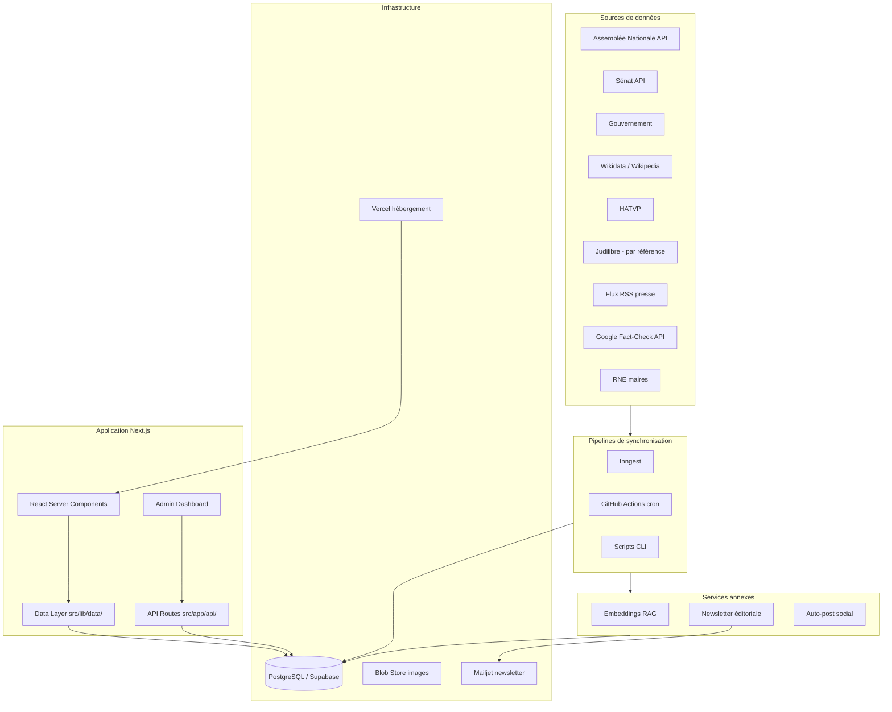
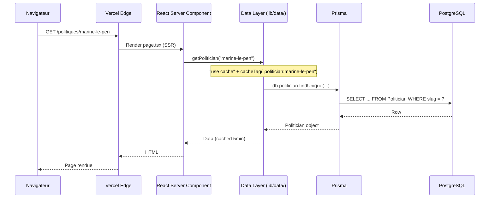
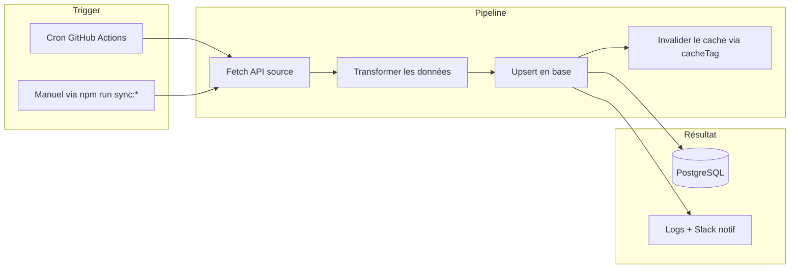
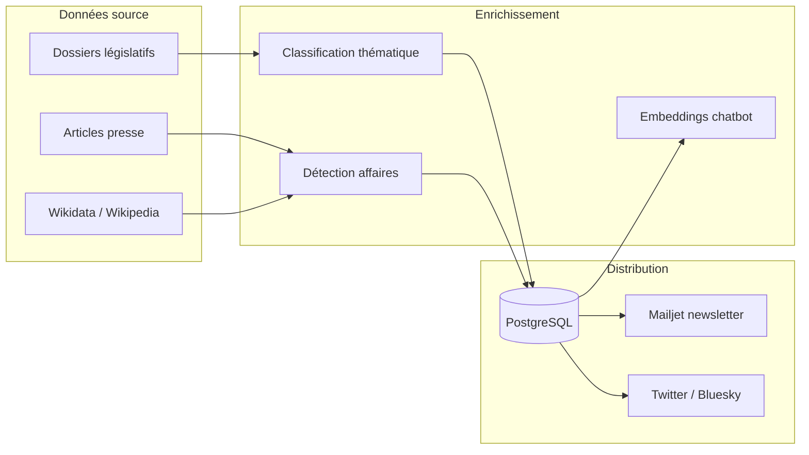
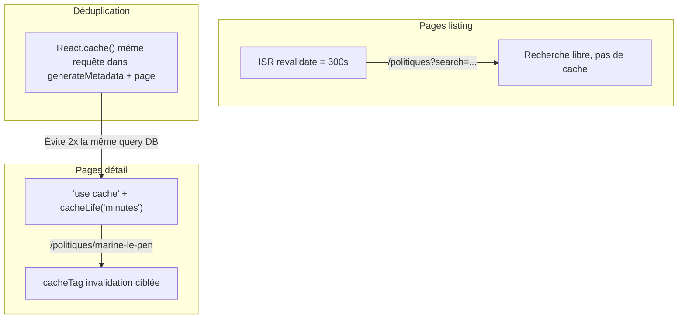
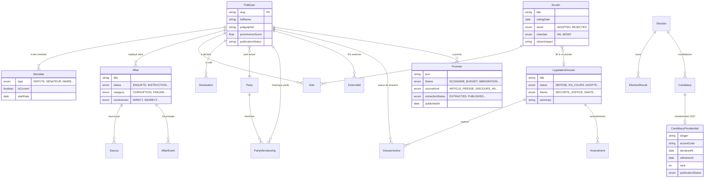

# Architecture technique

> **Dernière mise à jour** : 2026-03-08

---

## 1. Vue d'ensemble

Poligraph est un observatoire civique qui agrège des données publiques sur les politiques français. L'architecture suit un pattern **SSR-first** avec Next.js App Router, un **data layer cacheable** via Prisma, et des **pipelines de sync asynchrones** via Inngest.



---

## 2. Stack technique

| Composant       | Technologie                    | Version |
| --------------- | ------------------------------ | ------- |
| Framework       | Next.js (App Router)           | 16.x    |
| Langage         | TypeScript (strict)            | 5.x     |
| Base de données | PostgreSQL                     | 16+     |
| ORM             | Prisma                         | 7.x     |
| UI Components   | shadcn/ui + Radix              | -       |
| Styling         | Tailwind CSS                   | 4.x     |
| Charts          | D3.js (SVG)                    | 7.x     |
| Tests           | Vitest + React Testing Library | -       |
| Hébergement     | Vercel                         | -       |
| BDD managée     | Supabase (PostgreSQL)          | -       |
| Jobs async      | Inngest                        | -       |
| Embeddings      | Voyage AI (voyage-3-lite)      | -       |
| Newsletter      | Mailjet + MJML                 | -       |
| CI              | GitHub Actions                 | -       |

---

## 3. Structure du projet

```
src/
├── app/                    # Next.js App Router (73 pages)
│   ├── politiques/         #   Fiches et listes politiciens
│   ├── affaires/           #   Affaires judiciaires
│   ├── partis/             #   Partis politiques
│   ├── votes/              #   Scrutins parlementaires
│   ├── assemblee/          #   Dossiers législatifs (En direct de l'Assemblée)
│   ├── statistiques/       #   Dashboard statistiques
│   ├── comparer/           #   Comparateur
│   ├── elections/          #   Élections (municipales 2026)
│   ├── mon-observatoire/   #   Watchlist personnelle
│   ├── factchecks/         #   Fact-checks agrégés
│   ├── presse/             #   Revue de presse
│   ├── recap/              #   Récap hebdomadaire
│   ├── admin/              #   Dashboard admin (auth HMAC)
│   └── api/                #   Routes API (admin + public + inngest)
│
├── components/             # Composants React (25 répertoires)
│   ├── ui/                 #   Primitives shadcn/ui (Button, Card...)
│   ├── layout/             #   Header, Footer, Navigation
│   ├── politicians/        #   Cartes, filtres, profils politiciens
│   ├── affairs/            #   Timeline, détails affaires
│   ├── legislation/        #   DossierCard, Timeline, FilterBar, Authors
│   ├── votes/              #   Badges, cartes scrutins
│   ├── stats/              #   Charts (DonutChart, HorizontalBars...)
│   ├── elections/          #   Municipales, countdown, cartes
│   ├── filters/            #   FilterBarShell, SelectFilter (composants réutilisables)
│   ├── compare/            #   Comparaison côte-à-côte
│   ├── search/             #   Recherche globale (Cmd+K)
│   ├── admin/              #   Formulaires admin, éditeurs
│   └── seo/                #   JsonLd, SeoIntro
│
├── config/                 # Configuration et constantes
│   ├── labels.ts           #   150+ enum vers label français
│   ├── wikidata.ts         #   Q-IDs connus (partis, positions)
│   └── colors.ts           #   Couleurs partis et thèmes
│
├── lib/                    # Utilitaires et couche données
│   ├── data/               #   Data layer (12 modules cachés)
│   │   ├── politicians.ts  #     getPolitician, getPoliticianForComparison
│   │   ├── affairs.ts      #     getAffairs, getAffairsFiltered
│   │   ├── parties.ts      #     getParty, getPartyLeadership
│   │   ├── declarations.ts #     getDeclarations, getDeclarationStats
│   │   ├── votes.ts        #     getScrutins, getLegislatures, getChambers
│   │   ├── elections.ts    #     getUpcomingElections, getElections
│   │   ├── factchecks.ts   #     getFactchecks, getFactcheckStats
│   │   ├── departments.ts  #     getDeputiesByDepartment, getSenatorsByDepartment
│   │   ├── municipalities.ts #   getMaires, getMaireStats
│   │   ├── compare.ts      #     Comparaison de politiciens
│   │   ├── recap.ts        #     getWeeklyRecap
│   │   └── hemicycle.ts    #     Données hémicycle
│   ├── api/                #   Clients API externes (Wikidata, RSS...)
│   │   ├── with-admin-auth.ts  # HOF wrapper routes admin
│   │   ├── with-public-route.ts # HOF wrapper routes publiques
│   │   ├── pagination.ts       # parsePagination() utilitaire
│   │   └── anthropic.ts        # callAnthropic() wrapper API Anthropic
│   ├── email/              #   Newsletter Mailjet + sélection politicien
│   ├── social/             #   Auto-post Twitter/Bluesky
│   ├── security/           #   Validation Zod, audit logging
│   ├── identity/           #   Identity Resolution Engine
│   ├── cache.ts            #   invalidateEntity(), cacheTag helpers
│   ├── db.ts               #   Prisma singleton (pg pool)
│   └── utils.ts            #   Helpers (formatDate, slugify...)
│
├── services/               # Logique métier
│   ├── sync/               #   Services de synchronisation (39 fichiers)
│   ├── affairs/            #   Enrichissement, modération, matching
│   └── chat/               #   Chatbot RAG (patterns, embeddings)
│
├── inngest/                # Jobs asynchrones Inngest (13 fonctions)
│   └── functions/          #   Pipelines : sync, social, newsletter, IA
│
├── types/                  # Types TypeScript partagés
└── generated/prisma/       # Client Prisma auto-généré (NE PAS ÉDITER)
```

---

## 4. Flux de données

### 4.1 Cycle de vie d'une requête utilisateur



### 4.2 Pipeline de synchronisation



### 4.3 Pipeline d'enrichissement



### 4.4 Stratégie de cache



---

## 5. Modèle de données (simplifié)



Le schéma complet comprend 65 modèles Prisma (ajout de `CandidacyPresidential` en Q4 2026 pour le profil candidat présidentielle 2027, après `Promise` pour le Tracker promesses 2027).

---

## 6. Patterns clés

### 6.1 Data Layer (`src/lib/data/`)

Toutes les requêtes DB passent par le data layer. Les pages importent depuis `@/lib/data/*`, **jamais** depuis `@/lib/db` directement.

```typescript
// src/lib/data/politicians.ts
export const getPolitician = cache(async function getPolitician(slug: string) {
  "use cache";
  cacheTag(`politician:${slug}`, "politicians");
  cacheLife("minutes");
  return db.politician.findUnique({ where: { slug }, include: { ... } });
});
```

### 6.2 Cache : 3 niveaux

| Niveau                                 | Quand l'utiliser                  | Exemple                         |
| -------------------------------------- | --------------------------------- | ------------------------------- |
| `"use cache"` + `cacheLife("minutes")` | Pages détail, params bornés       | `getPolitician(slug)`           |
| `revalidate = 300` (ISR)               | Pages listing avec search         | `/politiques?page=2`            |
| `React.cache()`                        | Déduplication dans un même render | `generateMetadata()` + `page()` |

**Règle d'or** : ne JAMAIS mettre `"use cache"` sur une fonction avec un paramètre `search` libre (explosion de cache).

### 6.3 Admin Auth

Toutes les routes API admin utilisent le wrapper `withAdminAuth()` :

```typescript
// src/app/api/admin/affairs/route.ts
import { withAdminAuth } from "@/lib/api/with-admin-auth";
export const POST = withAdminAuth(async (req) => { ... });
```

Les routes publiques utilisent `withPublicRoute()` pour la gestion d'erreurs.

### 6.4 Labels et i18n

Les enums Prisma sont traduits via `src/config/labels.ts`. Ne jamais hardcoder un label français :

```typescript
import { AFFAIR_STATUS_LABELS } from "@/config/labels";
const label = AFFAIR_STATUS_LABELS[affair.status]; // "Enquête préliminaire"
```

### 6.5 Filtres réutilisables

Les pages listing utilisent un pattern de filtres standardisé :

```typescript
// Composant client
import { useFilterParams } from "@/hooks/useFilterParams";
import { SelectFilter } from "@/components/filters";
import { FilterBarShell } from "@/components/filters/FilterBarShell";
```

Ce pattern est utilisé sur `/politiques`, `/affaires`, `/assemblee`, `/municipales`, `/factchecks`.

### 6.6 Enrichissement et contenus éditoriaux

**Scripts d'enrichissement** (CLI + Inngest) :

- Classification thématique des scrutins et dossiers (`classify:themes`)
- Détection d'affaires judiciaires via Wikidata + Wikipedia (`discover:affairs`)
- Analyse d'articles de presse (`sync:press-analysis`)
- Indexation vectorielle pour le chatbot RAG (`index:embeddings`)

**Contenus éditoriaux** (saisis via le dashboard admin) :

- Biographies de politiciens (`biography`)
- Résumés de scrutins (`summary`)
- Impacts citoyens (`citizenImpact`)
- Résumés de dossiers législatifs (`summary`)
- Descriptions de partis (`description`)

L'API Anthropic est utilisée par certains scripts d'enrichissement. Toute interaction passe par `callAnthropic()` depuis `@/lib/api/anthropic`. Le contenu DB est sanitisé avant interpolation dans les prompts (délimiteurs XML).

### 6.7 Identity Resolution

Le matching cross-source passe par `batchResolve()` depuis `@/lib/identity/`. Seules les décisions avec confiance >= 0.95 sont auto-liées. Les décisions sont journalisées dans `IdentityDecision`. Voir `docs/DATA-MATCHING.md` et `docs/identity-strategy.md`.

### 6.8 Newsletter

Newsletter hebdomadaire "Alerte Vote" envoyée chaque lundi via Inngest + Mailjet :

- Sélection d'un politicien spotlight via `scoreDiversity()` (évite les répétitions)
- Récap de la semaine via `getWeeklyRecap()` (votes, affaires, presse)
- Template MJML compilé en HTML
- Envoi via Campaign Draft API Mailjet (pour gestion des désinscriptions)

### 6.9 Auto-post social

Publication automatique sur Twitter et Bluesky, 3 fois par jour (08:00, 12:30, 18:00 Paris) :

- Sélection de contenu pertinent (votes, affaires, dossiers)
- Génération de texte automatisée
- Publication via les APIs Twitter et Bluesky
- Orchestré par `src/inngest/functions/post-social.ts`

### 6.10 Tracker promesses 2027

Pilier prototype Q4 2026, backend uniquement (pas de page publique avant Q1 2027).

- **Modèle dédié** : `Promise` table autonome rattachée à `Politician`. Distinct sémantiquement de `Proposal` (synthèse structurée d'un programme parti pour la Boussole) : une promesse est un événement déclaratif daté, attribué à un politicien individuel. Aucun couplage entre les deux modules.
- **Sources d'ingestion** : (a) `PressArticle` existant via extraction Haiku (`src/services/promises/press-source.ts`) ; (b) CRI AN via parser XML (`src/services/promises/cri-source.ts`), industrialisation Q1.
- **Tagging hybride** : règles déterministes mots-clés d'abord (`src/services/promises/rules.ts`), fallback Claude Haiku si confiance insuffisante (`theme-classifier.ts`). Méthode et confiance stockées en DB pour audit.
- **Modération** : tableau de bord admin à `/admin/promises` avec filtres status/thème, actions Publier / Rejeter / À retraiter / Supprimer. Toutes les mutations passent par `withAdminAuth` + `withValidation` Zod + `auditLog`.
- **Préparation Q1** : champ `linkedVoteId?` réservé sur `Promise` pour la future jointure « promesse vs réalité » (issue #202).
- **Pas de feature flag** : aucune surface publique en Q4, donc rien à gater.

### 6.11 Profil candidat présidentielle

Pilier prototype Q4 2026, admin-gated. Surface publique différée à Q1 2027.

- **Modèle dédié 1:1** : `CandidacyPresidential` extension de `Candidacy` (pattern identique à `MandateLocal`, `MandateGovernment`). Réutilise les 11 `Candidacy` déjà sourcées pour `presidentielle-2027` plutôt qu'une table parallèle.
- **Layout linéaire mobile-first** : 6 sections numérotées dans l'ordre éditorial Vision, Boussole, Action, Parcours, Intégrité, Affaires. Desktop devient 2-col en `lg:` pour les sections riches (radar + promesses).
- **2 composants nouveaux et limités** : `CandidateHero` (entête éditorial, chip cross-cycle 2022, contraste WCAG AA adaptatif aux couleurs de parti claires), `ThemeFocusRadar` (SVG natif sans dépendance, axes à 72° pour 5 thèmes max, liste textuelle accessible et SVG `aria-hidden`). Les sections Action, Parcours, Intégrité et Affaires renvoient pour l'instant vers la fiche politicien existante (le Q1 connectera les composants riches).
- **Comparateur** : route dédiée `/admin/candidats/[slug]/comparer/[otherSlug]`. Split-screen 50/50 desktop, tabs sticky sur mobile pour le radar. Pas de score ni de classement, mise en parallèle factuelle uniquement.
- **Seed cross-cycle** : minimal `presidentielle-2022` (12 `Candidacy` cibles, 10 effectives après filtre sur les politiciens présents en base, 2 `ElectionRound`, résultats T1 et T2 sur `Candidacy.round1Pct`/`round2Pct`) pour permettre le chip « Déjà candidat 2022 » dans le hero.
- **Admin only Q4** : toutes les routes sous `/admin/candidats/...` avec `withAdminAuth` + `withValidation` Zod + `auditLog`. `CandidacyPresidential.publicationStatus = DRAFT` par défaut, Q1 flippera à `PUBLISHED` pour la route publique.

---

## 7. Zones de contribution

| Zone                          | Difficulté | Description                                         |
| ----------------------------- | ---------- | --------------------------------------------------- |
| `src/components/ui/`          | Facile     | Composants shadcn/ui, amélioration visuelle         |
| `src/config/labels.ts`        | Facile     | Labels, traductions manquantes                      |
| `tests/`                      | Facile     | Tests unitaires (beaucoup de composants non testés) |
| `src/components/stats/`       | Moyen      | Charts et visualisations                            |
| `src/components/politicians/` | Moyen      | Composants profil politicien                        |
| `src/app/*/page.tsx`          | Moyen      | Pages publiques                                     |
| `src/lib/data/`               | Avancé     | Couche données + caching                            |
| `scripts/`                    | Avancé     | Scripts de synchronisation (APIs externes)          |
| `src/services/sync/`          | Avancé     | Pipelines de sync                                   |

---

## 8. Commandes de développement

```bash
# Développement
npm run dev              # Serveur dev (localhost:3000)

# Qualité
npm run lint             # ESLint
npm run typecheck        # TypeScript strict
npm run format           # Prettier
npm run test:run         # Vitest

# Base de données
npm run db:studio        # Explorer visuellement la BDD
npm run db:push          # Appliquer les changements de schéma
npm run db:generate      # Générer le client Prisma
```

---

## 9. Sécurité

- **Auth admin** : HMAC token en cookie HTTP-only
- **CSP** : Content-Security-Policy strict (pas de `unsafe-eval` en prod)
- **Validation** : Zod schemas via `withValidation()` sur les routes POST/PUT/PATCH
- **Rate limiting** : Tiers via middleware (général, search, export, admin, subscribe)
- **Audit logging** : Toutes les mutations admin loguées avec IP et user-agent
- **Données** : uniquement des données publiques, pas de tracking visiteurs
- **Présomption d'innocence** : champs judiciaires default au plus conservateur (`involvement: "MENTIONED_ONLY"`)
- **Factchecks** : whitelist de sources francophones (`FACTCHECK_ALLOWED_SOURCES`)
- **Prompts IA** : contenu DB sanitisé, délimiteurs XML, jamais d'interpolation brute
